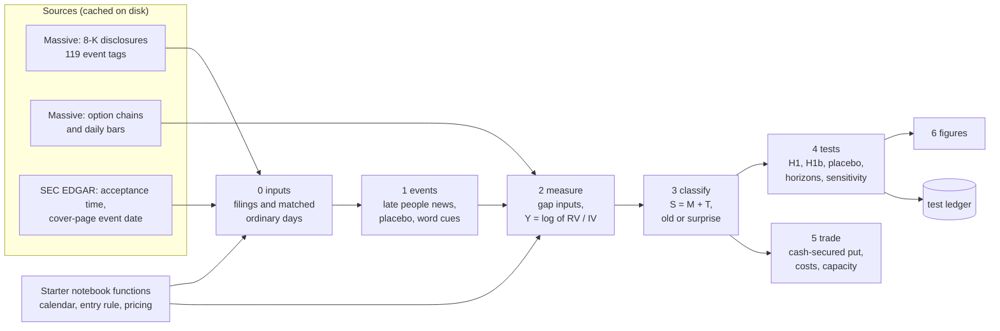

# Old news, new news · Gator Quant Hacks 2026 · Trade the 8-K

Our entry to the Systematic Trading track and Massive's "Trade the 8-K" bonus. We test one committed
hypothesis about executive and director 8-K filings (Item 5.02) at the 100 largest US companies, and the
trade that follows from it: a cash-secured put sold only after "old news" filings.

- The hypothesis: [`docs/hypothesis.md`](docs/hypothesis.md)
- Every rule of the test, committed before any outcome was computed: [`docs/test_plan.md`](docs/test_plan.md)
- The notebook: [`gator-quant-hacks-8k-options-challenge.ipynb`](gator-quant-hacks-8k-options-challenge.ipynb),
  section **Old news, new news**, and the sealed-window cell at the end

## The idea in plain words

A company has up to four business days to file an 8-K after an executive or director leaves or is appointed,
and most filings at large companies arrive days after the event. By then, two different things may have
happened:

- **Old news.** The market already knew. The stock moved unusually between the event and the filing, or the
  filing itself says the news was announced earlier.
- **Surprise news.** The filing is the first the market hears of it. The stock was quiet in the gap and the
  filing gives no sign the news was public.

Either way, the filing is a fresh, dated headline that draws option buyers and lifts implied volatility, the
price of protection. After surprise news that price pays for a move that is still to come. After old news it
pays for a move that has already happened. So we predict that **realised volatility falls short of implied
volatility by more after old-news filings than after surprise filings**, and that selling a cash-secured put
on old-news filings earns that gap.

How a filing is labelled, without looking at what happens next: a math score from the gap (the stock's move
against the market, the change in implied volatility, the option volume) plus a word score from the filing
(a dated earlier announcement, "previously announced", a related filing in the past 30 days). The weights, the
cutoff, the primary test (h = 10 sessions, 1-month options) and the placebo (late scheduled filings such as
vote results) are all fixed in the test plan.

## How it works



| Step | Code | Output in `data/oldnews/` |
|---|---|---|
| 0 inputs | `src/oldnews/pipeline.py` | `raw/events_<label>.csv`, `raw/nulls_<label>.csv` |
| 1 events | `src/oldnews/events.py` | `events_<label>.csv`, `nulls_<label>.csv` |
| 2 measure | `src/oldnews/measure.py` | `gap_<label>.csv`, `outcome_<label>.csv` |
| 3 classify | `src/oldnews/classify.py` | `classified_<label>.csv` |
| 4 tests | `src/oldnews/tests.py` | `results_<label>/` (tables, `summary.md`), `ledger.csv` |
| 5 trade | `src/oldnews/trade.py` | `trade_<label>/` (tables, `summary.md`) |
| 6 figures | `src/oldnews/figures.py` | `figures/<label>/` (fade curve, one filing end to end, placebo) |

`src/oldnews/pipeline.py` runs the steps in order with `run_oldnews(start, end, label)`. It reuses the
starter notebook's own functions (loaded by `src/nb.py`, or the notebook's namespace when called from a cell),
so the API client, the trading calendar, the acceptance-time entry rule and the pricing engine are the ones
the judges run.

## Run it

**One command** (the 2024 to 2025 test, from the cache; a human runs it once, unchanged):

```bash
.venv/Scripts/python.exe src/oldnews/pipeline.py --label insample      # Windows
.venv/bin/python src/oldnews/pipeline.py --label insample              # macOS / Linux
```

The test label is `insample`. `--start` and `--end` narrow the dates inside 2024 to 2025;
`--allow-fetch` lets the notebook's cached API functions download what is missing. `--dry-run` is a quiet
end-to-end check of the judges' path on 2024-07-01 to 2024-12-31: it prints only the event count, the wall time
and whether each stage ran, writes to a temporary folder and deletes it.

**In the notebook:** run all cells. The section *Old news, new news* is off until a human switches the test on
once (`OLDNEWS_RUN["insample"]`).

**Sealed window (judges):** in section 2 set `HOLDOUT_START`, `HOLDOUT_END` and `RUN_HOLDOUT = True`, then run
the notebook. The last cell runs our test on that window first, downloading what it needs, and prints the
number of events, the H1 effect with its 95% interval and p-value, and "descriptive" when fewer than 30 events
qualify. Then come the trading record and the figures.

**On a clean machine** (no cache), set `OLDNEWS_ALLOW_FETCH = True` in the notebook's *Old news, new news*
setup cell. Downloads go one request at a time through the notebook's cached `api_get`, and the expected
request count and runtime are printed before each download (`max_requests` refuses a run above a ceiling). A run
prices its own rows plus at most 400 extra seeded ticker-dates for the market panel (inside 2024 to 2025 for
the test). Each priced ticker-date costs about 25 requests.

**Numbers for the note and this README.** `.venv/Scripts/python.exe src/oldnews/report.py --label insample`
writes `data/oldnews/README_numbers.md` from the results tables, so the note, this README and the notebook
quote the same numbers; copy them from that file, never retype them.

**Tests:** every module has a fast synthetic test (no data, no network), for example
`.venv/Scripts/python.exe tests/test_oldnews_trade.py`.

**A voice for every run (optional, ElevenLabs).** Any pipeline run can narrate its own results. After a run,
`extras/audio_brief.py` builds a two-minute spoken research brief from that run's own result files (the question,
the result with its interval and p-value, the placebo, the trade net of costs, and the honest conclusion) and
voices it with the ElevenLabs text-to-speech API. No one writes or edits the script, so a judge's sealed-window
run gets a brief with its own numbers:

    .venv/Scripts/python.exe extras/audio_brief.py --label insample            # our 2024-25 test
    .venv/Scripts/python.exe extras/audio_brief.py --label holdout             # after the sealed-window run
    .venv/Scripts/python.exe extras/audio_brief.py --label holdout --dry-run   # script text only, no key needed

It needs `ELEVENLABS_API_KEY` in `.env` (never commit it) and writes `data/oldnews/audio/brief_<label>.mp3`.
It is an add-on: it is not part of the judged notebook and changes no result. See `extras/README.md`.

## Data and rules

- **No key in the repository.** The key lives in `.env` (git-ignored) and is read only by the notebook's
  `load_api_key()`. Never paste it into a cell, a command or a file.
- **No data in the repository.** `.massive_cache/` (raw API responses) and `data/` (everything derived from
  them) are git-ignored, because the data are licensed. The notebook is committed with its outputs cleared.
- **One test, through our pipeline only.** Our test on 2024-2025 (the plan's confirmation window) is run only
  through our pipeline, once and unchanged. The starter's CFO-appointment example in the notebook, which also
  uses those dates, is not part of our test.
- **Frozen constants.** The z-score constants that standardise the math inputs are frozen once from the
  in-sample ordinary days in `src/oldnews/zref_frozen_insample.json` and applied unchanged to every window. The
  pipeline only reads that file and stops with a clear message if it is missing.
- **Out-of-sample is off.** `RUN_OOS = False` in section 2. The 2026 section is implemented and tested but
  shipped off, as the notebook's signed warning requires, and no 2026 result is reported; the
  2024-2025 test was itself one-shot, and the judges' sealed-window rerun is the true out-of-sample check.
- **Dates are guarded in code.** Massive asked contestants to use only 2024-2025 data (earlier history exists
  but is off limits; the sealed placeholder is 2023-06-01 to 2023-08-31), so the test reads only dates from
  2024-01-01 to before 2026-01-01; any other window label is refused. The sealed window runs only with `RUN_HOLDOUT = True`. Each module checks its own dates and stops if one is out of range.
- **No lookahead.** Entry is the first close after the EDGAR acceptance time (a filing accepted after 15:30 ET,
  or the same margin before an early close, enters the next session). Every classification input is known by
  the last close before acceptance.
- **Costs everywhere.** Every option trade pays the larger of 5% of premium or $0.05 per share on entry and on
  exit, and every result is repeated at double costs. Capacity is capped at 10% of the put's entry-day volume.
- **Every test is logged.** Each variant the tests evaluate is appended to the test ledger, so the number of
  variants can be disclosed (420 rows: 242 for the 2024-2025 test, 178 from the discarded 2022-2023
  exploration). Seeds are fixed (20261003).
- **Known limitations.** The universe is today's top 100 applied to the past (survivorship bias); the stock
  price is recovered from option prices by put-call parity with a flat rate and no dividends; option marks are
  last trades, not quotes; earnings tagging in the 8-K data is incomplete, so some earnings dates are missed.

## Setup (about 2 minutes)

You need **Python 3.10+** ([python.org](https://www.python.org/downloads/)) and a **Massive API key**.

**macOS / Linux** — in a terminal, from this folder:

```bash
./setup.sh
```

**Windows** — in PowerShell, from this folder:

```powershell
powershell -ExecutionPolicy Bypass -File setup.ps1
```

The script creates a `.venv`, installs `requirements.txt`, registers the Jupyter kernel
**Python (Gator Quant Hacks .venv)**, and creates `.env` from `.env.example`. It is safe to re-run.

Then:

1. Open `.env` and replace `your-key-here` with your key (no spaces or quotes).
2. Start Jupyter: `source .venv/bin/activate && jupyter lab` (Windows: `.venv\Scripts\activate; jupyter lab`),
   or open the notebook in VS Code.
3. Pick the kernel **Python (Gator Quant Hacks .venv)** and run all cells. Section 1 prints
   `API key loaded (ends xxxx)` when it finds your key. API responses are cached in `.massive_cache/`, so
   later runs are fast.

## Manual setup

```bash
python3 -m venv .venv
source .venv/bin/activate          # Windows: .venv\Scripts\activate
python -m pip install -r requirements.txt
python -m ipykernel install --user --name gator-quant-hacks --display-name "Python (Gator Quant Hacks .venv)"
cp .env.example .env               # then add your key
```

Already have a Jupyter environment (Colab, an existing kernel)? Skip all of this and run the
optional `%pip install -r requirements.txt` cell at the top of the notebook, then restart the kernel.

## Troubleshooting

- **"Kernel not found" when opening the notebook** — run the setup script, or just pick any Python 3.10+ kernel.
- **`ModuleNotFoundError`** — the notebook is on a different kernel than the one you installed into.
  Run `import sys; print(sys.executable)` in a cell; it should end in `.venv/bin/python`.
- **Prompted for an API key** — `.env` is missing, in the wrong folder, or still has the placeholder.
- **"not run. This window is not in the API cache"** — expected on a clean machine; set
  `OLDNEWS_ALLOW_FETCH = True` in the *Old news, new news* setup cell.
- **Slow iteration** — set `RUN_PLACEBO = False` in section 2 while exploring the starter's own analysis
  (saves ~8 minutes per run); turn it back on before you submit.
- **Stale recent data** — the cache never expires. Delete `.massive_cache/` to refetch.

Keep `.env` out of anything you share or submit; `.gitignore` already excludes it.
